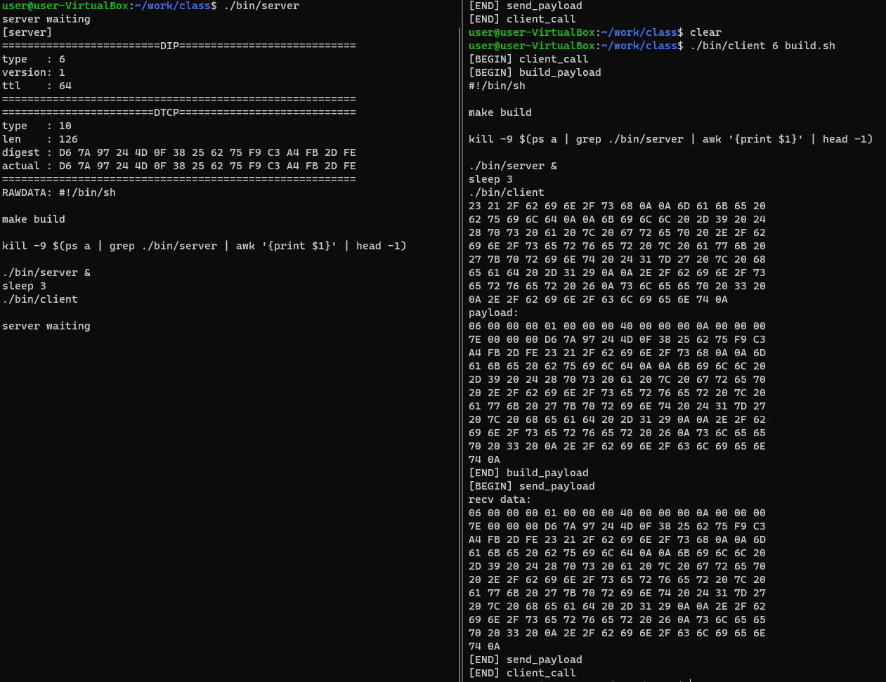
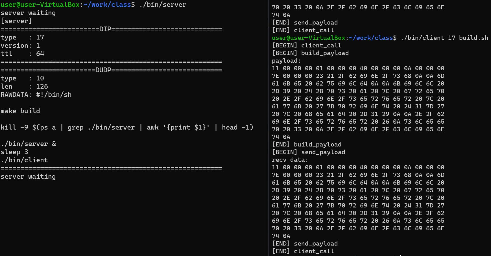

# TCP/IPを模した3層アーキテクチャ
## 概要
本システムは、TCPを用いてTCP/IPのレイヤードアーキテクチャを模擬したシステムで、3層で構成される。第一層はデータ層、第二層はDTCPもしくはDUDP層、第三層はDIP層である。

## 第一層
第一層はデータ層である。

この層は、ヘッダとして下記の3フィールドを持つ。

|フィールド|長さ(Bytes)|意味|
|:-:|:-:|:-:|
|type|4|上位プロトコルタイプを表す|
|version|4|DIPバージョンを示す|
|ttl|4|time to live|

## 第二層
第二層は、DTCPもしくはDUDP用のデータ層である。

### DTCP(protocol type 6)
この層は、ヘッダとして下記の3フィールドを持つ。ここで、ペイロードのMD5値が不正なパケットと判断された場合、改ざんされていた場合には即座に処理を終了する。

|フィールド|長さ(Bytes)|意味|
|:-:|:-:|:-:|
|type|4|上位プロトコルタイプを表す|
|len|4|ペイロードの長さ|
|digest|4|ペイロードのMD5値|

### DUDP(protocol type 17)
この層は、ヘッダとして下記の2フィールドを持つ。

|フィールド|長さ(Bytes)|意味|
|:-:|:-:|:-:|
|type|4|上位プロトコルタイプを表す|
|len|4|ペイロードの長さ|

## 第一層
この層はデータを管理する。

## 必要なもの(Ubuntu)
 - gcc
 - make
 - libcunit1-dev
 - libc-dev

## 必要なもの(Docker)
 - Docker
 - make

## 使い方
サーバを起動してからクライアントを実行することで、クライアントからサーバにリクエストを飛ばすことができる。

### ローカルでの実行
```bash
make build
./bin/server &
sleep 3 # サーバが立つまで少し待機
./bin/client 17 build.sh # dudpでbuild.shを送る
./bin/client 6 build.sh # dtcpでbuild.shを送る
```

### Dockerコンテナ内での実行
```bash
make docker-build
make docker-run
# ここからコンテナ内
./binserver &
sleep 3 # サーバが立つまで少し待機
./bin/client 17 build.sh # dudpでbuild.shを送る
./bin/client 6 build.sh # dtcpでbuild.shを送る
```

## 実行例
DTCPを指定してクライアント(右)からサーバ(左)にbuild.shのデータを送信した例



DUDPを指定してクライアント(右)からサーバ(左)にbuild.shのデータを送信した例



## テスト
テスティングツールとしてCUnitを採用しました。

```bash
make test
(snip)
***************** CUNIT CONSOLE - MAIN MENU ******************************
(R)un  (S)elect  (L)ist  (A)ctivate  (F)ailures  (O)ptions  (H)elp  (Q)uit
Enter command: R
(snip)
```
